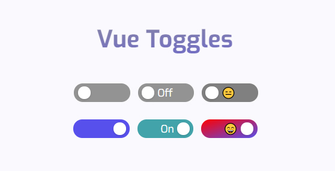

<h1 align="center">Vue Toggles</h1>
<p align="center">
A highly customizable and accessible toggle.
</p>

<p align="center">
<a href="https://www.npmjs.com/package/vue-toggles"> </a> <a href="https://vuejs.org/"></a>
</p>

<p align="center">

</p>

## Demo

- [Demo](https://vue-toggles.netlify.app/)
- [CodeSandbox](https://codesandbox.io/s/vue-toggles-mkkp4?file=/src/App.vue)

## Introduction

Vue Toggles comes out of the box with accessibility support for:

- `aria-checked` depending on state
- `aria-readonly` if the toggle is disabled
- `prefers-reduced-motion` if the user has requested any type of motion reduction [[prefers-reduced-motion](https://developer.mozilla.org/en-US/docs/Web/CSS/@media/prefers-reduced-motion)]

### Accessibility

What's left for you, when it comes to accessibility, is labeling the toggle correctly. This is either done by:

- A `<label for="example-id">Toggle description</label>` followed by the toggle component `<VueToggles id="example-id" />`
- An `aria-label`, for example `<VueToggles aria-label="Toggle description" />`. Remember, you still need a visual text description of what the toggle does

The `focus`-style is also left up to you — which is recommended you don't remove. If you think the default is ugly, style it yourself!

## Installation

```
npm i vue-toggles
```

### Import

```javascript
import Vue from 'vue';
import VueToggles from 'vue-toggles';

Vue.component('VueToggles', VueToggles);
```

> :warning: **If you are using Nuxt**: You need to disable SSR for the plugin. This is done first in the `nuxt.config.js` file with `plugins: [{ src: "~plugins/vue-toggles.js", mode: "client" }]`. And then wrapping the `<VueToggles>`-component with a `<client-only>`

- [The plugins Property](https://nuxtjs.org/api/configuration-plugins/)
- [The client-only Component](https://nuxtjs.org/api/components-client-only/)

## Usage

The toggle is very easy to use out of the box. The bare minimum for it to work is a `@click`-function and a `:value`-prop.

```html
<VueToggles @click="value = !value" :value="value" />
```

## Options

You can also add more props to customize things like color and width/height.

```html
<VueToggles
  @click="value = !value"
  :value="value"
  height="30"
  width="90"
  checkedText="On"
  uncheckedText="Off"
  checkedBg="#b4d455"
  uncheckedBg="lightgrey"
/>
```

## Properties

| Name           | Type             | Default   | Description                                       |
| -------------- | ---------------- | --------- | ------------------------------------------------- |
| value          | Boolean          | `false`   | Initial state of the toggle button                |
| disabled       | Boolean          | `false`   | Toggle does not react on mouse or keyboard events |
| reverse        | Boolean          | `false`   | Reverse toggle to Right to Left                   |
| height         | [String, Number] | `25`      | Height of the toggle in `px`                      |
| width          | [String, Number] | `75`      | Width of the toggle in `px`                       |
| checkedText    | String           | `null`    | Optional text when the toggle is checked          |
| uncheckedText  | String           | `null`    | Optional text when the toggle is unchecked        |
| checkedBg      | String           | `#5850ec` | Background color when the toggle is checked       |
| uncheckedBg    | String           | `#939393` | Background color when the toggle is unchecked     |
| checkedColor   | String           | `#ffffff` | Text color when the toggle is checked             |
| uncheckedColor | String           | `#ffffff` | Text color when the toggle is unchecked           |
| dotColor       | String           | `#ffffff` | Color of the toggle dot                           |
| fontSize       | [String, Number] | `12`      | Font size in `px`                                 |
| fontWeight     | [Number, String] | `normal`  | Font weight                                       |

### Browser compatibility

- Chrome: 40+
- Firefox: 25+
- Safari: 10+
- IE: 11+

### License

[MIT](http://opensource.org/licenses/MIT)
