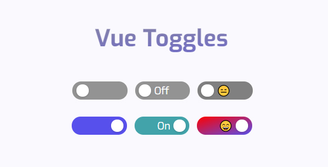

<h1 align="center">Vue Toggles</h1>
<p align="center">
A highly customizable and accessible toggle component for Vue 3.
</p>

<p align="center">
<a href="https://www.npmjs.com/package/vue-toggles"> </a> <a href="https://vuejs.org/"></a>
</p>

<p align="center">

</p>

## Introduction

Vue Toggles comes out of the box with accessibility support for:

- `aria-checked` depending on state
- `aria-readonly` if the toggle is disabled
- `prefers-reduced-motion` if the user has requested any type of motion reduction [[prefers-reduced-motion](https://developer.mozilla.org/en-US/docs/Web/CSS/@media/prefers-reduced-motion)]

### Accessibility

What's left for you, when it comes to accessibility, is labeling the toggle correctly. This is either done by:

- A `<label for="example-id">Toggle description</label>` followed by the toggle component `<VueToggles id="example-id" />`
- Or an `aria-label`, for example `<VueToggles aria-label="Toggle description" />`. Remember, you still need a visual text description of what the toggle does

The `focus`-style is also left up to you — which you shouldn't remove. If you think the default is ugly, style it yourself!

## Installation

```
npm i vue-toggles
```

### Import component

```javascript
import { VueToggles } from "vue-toggles";
```

### Import types

```javascript
import { type VueTogglesProps } from "vue-toggles";
```

## Usage

The toggle is very easy to use out of the box. The bare minimum for it to work is a `@click`-function and a `:value`-prop.

```html
<VueToggles :value="example" @click="example = !example" />
```

Or if you prefer the `v-model`-syntax:

```html
<VueToggles v-model="example" />
```

## Options

You can also add more props to customize things like color and width/height.

```html
<VueToggles
  :value="value"
  :height="30"
  :width="90"
  checkedText="On"
  uncheckedText="Off"
  checkedBg="#b4d455"
  uncheckedBg="lightgrey"
  @click="value = !value"
/>
```

## Properties

| Name               | Type             | Default   | Description                                       |
| ------------------ | ---------------- | --------- | ------------------------------------------------- |
| value              | Boolean          | `false`   | Initial state of the toggle button                |
| disabled           | Boolean          | `false`   | Toggle does not react on mouse or keyboard events |
| reverse            | Boolean          | `false`   | Reverse toggle to Right to Left                   |
| height             | [String, Number] | `25`      | Height of the toggle in `px`                      |
| width              | [String, Number] | `75`      | Width of the toggle in `px`                       |
| dotColor           | String           | `#ffffff` | Color of the toggle dot                           |
| uncheckedBg        | String           | `#939393` | Background color when the toggle is unchecked     |
| checkedBg          | String           | `#5850ec` | Background color when the toggle is checked       |
| uncheckedTextColor | String           | `#ffffff` | Text color when the toggle is unchecked           |
| checkedTextColor   | String           | `#ffffff` | Text color when the toggle is checked             |
| uncheckedText      | String           | `""`      | Optional text when the toggle is unchecked        |
| checkedText        | String           | `""`      | Optional text when the toggle is checked          |
| fontSize           | String           | `12`      | Font size in `px`                                 |
| fontWeight         | String           | `normal`  | Font weight                                       |

## Vue 2 support

If you're looking for Vue 2 support, the `1.1.4`version is available [here](https://www.npmjs.com/package/vue-toggles/v/1.1.4).

## License

[MIT](http://opensource.org/licenses/MIT)
